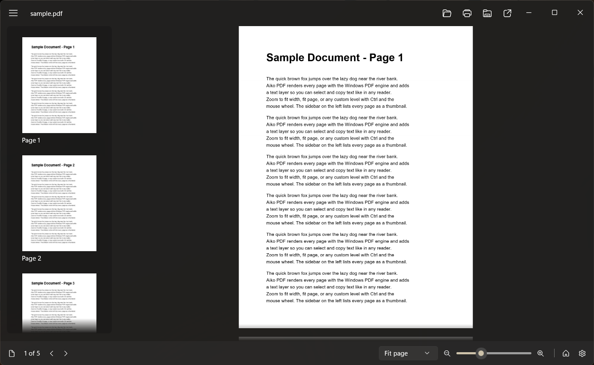

<p align="center">
    
</p>

<h1 align="center">
    Aiko PDF
</h1>

<p align="center">
    A native WinUI 3 PDF reader for Windows.<br>
    Aiko — 愛子 — Love, child, child of love.
</p>



I built this because I wanted a simple PDF viewer that looked good. There is a
[sample document](docs/sample.pdf) to test the viewer if you want.

## Installing

<a href="https://apps.microsoft.com/detail/9MXL507LV5GG">
    
</a>

You can also install from the releases page.

## Building

You need the .NET 9 SDK and the Visual Studio 2022 build tools for the XAML compiler.

```bash
dotnet build AikoPdf/AikoPdf.csproj -p:Platform=x64
dotnet test tests/AikoPdf.Tests/AikoPdf.Tests.csproj
```

The app carries its own copy of the runtime, so a build runs on any supported PC as-is. To cut a release:

```bash
pwsh -File tools/build-release.ps1
```

## Shortcuts

| Keys | What it does |
| --- | --- |
| Ctrl+O | Open |
| Ctrl+P | Print |
| Ctrl+C | Copy the selection |
| Ctrl+A | Select the page |
| Ctrl+wheel | Zoom |
| Ctrl+Plus | Zoom in |
| Ctrl+Minus | Zoom out |
| Ctrl+0 | Fit page |
| Ctrl+1 | 100% |
| Ctrl+2 | Fit width |

## License

MIT, see [LICENSE](LICENSE). The parts Aiko PDF is built on are listed in [THIRD-PARTY-NOTICES.md](THIRD-PARTY-NOTICES.md).
