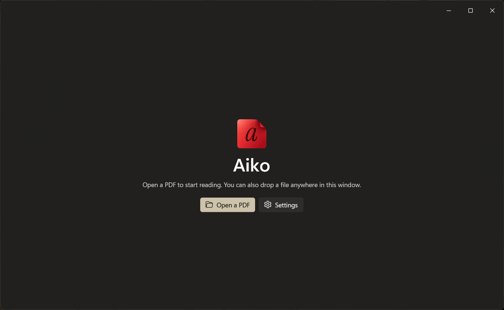

<p align="center">
    
</p>

<h1 align="center">
    Aiko
</h1>

<p align="center">
    A native WinUI 3 PDF reader for Windows. Open, read, select, copy.
</p>




I built this because I wanted a simple PDF viewer that looked good. There is a
[sample document](docs/sample.pdf) in this repo if you want something to open.

## Installing

Download `Aiko-<version>-x64.msix` and `Aiko.cer` from [Releases](https://github.com/artistro08/aiko-pdf/releases).

The package isn't signed, so installing it by itself won't work. you have to install the cert first (only if you trust it of course).

1. Double-click **Aiko.cer** and choose **Install Certificate**.
2. Pick **Local Machine**, then **Yes** at the prompt for administrator rights.
3. Choose **Place all certificates in the following store**, **Browse**, then **Trusted People**.
4. **Next**, then **Finish**. Windows says the import succeeded.
5. Double-click **Aiko-<version>-x64.msix** and choose **Install**.

That is it. Aiko is in the Start menu and offered for PDFs under **Open with**.

## Building

You need the .NET 9 SDK and the Visual Studio 2022 build tools for the XAML compiler.

```bash
dotnet build AikoPdf/AikoPdf.csproj -p:Platform=x64
dotnet test tests/AikoPdf.Tests/AikoPdf.Tests.csproj
```

The app carries its own copy of the runtime, so a build runs on any supported PC as-is. To cut a release:

```bash
pwsh -File tools/build-release.ps1
```

## Shortcuts

| Keys | What it does |
| --- | --- |
| Ctrl+O / Ctrl+P | Open, print |
| Ctrl+C / Ctrl+A | Copy the selection, select the page |
| Ctrl+wheel, Ctrl+Plus / Minus | Zoom |
| Ctrl+0 / Ctrl+1 / Ctrl+2 | Fit page, 100%, fit width |

## License

MIT, see [LICENSE](LICENSE). The parts Aiko is built on are listed in [THIRD-PARTY-NOTICES.md](THIRD-PARTY-NOTICES.md).
